# MandarinFlow

Production-oriented MVP for learning Chinese through YouTube videos. Users paste a YouTube URL, the YouTube player loads immediately, and subtitles are processed progressively in background batches delivered to the frontend over Server-Sent Events.

## Architecture

```mermaid
flowchart TD
    Browser[Browser] --> Player[YouTube Player]
    Browser --> Frontend[Next.js Frontend]
    Frontend --> API[FastAPI REST API]
    Frontend --> SSE[SSE Subtitle Stream]
    SSE --> API
    API --> Scheduler[Processing Scheduler]
    Scheduler --> Queue[Priority Batch Queue]
    Queue --> Processor[Subtitle Processor]
    Processor --> Segmentation[Segmentation]
    Processor --> Translation[Translation]
    Processor --> Pinyin[Pinyin]
    API --> Vocabulary[Vocabulary Service]
    API --> YouTube[YouTube Service]
    Processor --> Store[(PostgreSQL)]
    Vocabulary --> Store
    API --> Store
    Processor --> Cache[(Redis Cache)]
    API --> Cache
```



## System Flow

1. Users open the public home/video list and choose a completed video.
2. The YouTube player renders immediately from `/watch?v=...`.
3. The watch page reads existing subtitles first; it does not import/process unknown videos for normal users.
4. Developers open `/dev`, enter `DEV_ACCESS_TOKEN`, and import or delete videos with `X-Dev-Token`.
5. Raw Chinese subtitles are saved first and can be shown before translation/tokenization is ready.
6. The backend splits subtitles into timestamp-ordered batches, then an in-process priority queue processes each batch.
7. Each batch is normalized, segmented, translated with `translate_batch`, enriched with pinyin only, saved to PostgreSQL, cached in Redis, and published over SSE.
8. The frontend keeps received subtitle batches in state, merges/deduplicates them, and computes the active line locally with binary search.
9. Playback position updates are throttled. If the user seeks forward, the backend prioritizes the batch at that timestamp and the next two batches.
10. Detailed dictionary lookup is lazy-loaded only when the learner clicks a token.

ASR is optional. By default it is disabled, but the backend includes an OpenAI ASR provider that can transcribe YouTube audio when Chinese subtitles are unavailable.

## Project Structure

```text
youtube-language-learning/
├── frontend/
├── backend/
├── docker-compose.yml
├── .env.example
└── README.md
```

Backend modules follow route -> service -> repository/provider boundaries:

```text
backend/app/
├── main.py
├── api/
├── services/
├── models/
├── schemas/
├── db/
├── repositories/
└── core/
```

## Local Setup

Backend:

```bash
cd backend
python -m venv .venv
source .venv/bin/activate
pip install -r requirements.txt
alembic upgrade head
uvicorn app.main:app --reload
```

Frontend:

```bash
cd frontend
npm install
npm run dev
```

## Docker Setup

```bash
docker compose up --build
```

Frontend: `http://localhost:3000`

Backend: `http://localhost:8000`

Set `NEXT_PUBLIC_FEEDBACK_EMAIL` in `.env` before building the frontend if you want the public feedback form to open an email draft to your inbox:

```env
NEXT_PUBLIC_FEEDBACK_EMAIL=you@example.com
```

## VPS Deployment

Production uses `docker-compose.prod.yml` with Caddy as the only public entrypoint. PostgreSQL, Redis and application ports remain private to the Docker network. Only ports `80` and `443` should be public.

On a fresh VPS, run the bootstrap script from a temporary checkout. It installs Docker, clones `main` into `/root/mandarin_flow`, and refuses to overwrite an existing application directory:

```bash
sudo bash scripts/bootstrap_vps.sh
```

Create `/root/mandarin_flow/.env` from `.env.production.example`, configure the production values, and protect the file:

```bash
cd /root/mandarin_flow
cp .env.production.example .env
chmod 600 .env
```

The required production values include the public URLs, raw and URL-encoded PostgreSQL password, dev token, separate OpenAI keys, and all Telegram bot/webhook settings. `.env` is managed manually on the VPS; GitHub Actions validates it but never uploads or overwrites it.

Do not run production Compose without an immutable image tag. `IMAGE_TAG` is mandatory and must be a full commit SHA:

```bash
IMAGE_TAG=FULL_40_CHARACTER_COMMIT_SHA docker compose -f docker-compose.prod.yml config --quiet
```

## GitHub Actions Deployment

`.github/workflows/deploy.yml` is the canonical production path and runs on every push to `main`:

1. Run Go, backend and frontend tests.
2. Build and publish backend, Go API and frontend images tagged only with the commit SHA.
3. SSH to the VPS, update the checkout and authenticate to GHCR.
4. Validate `.env`, pull all exact-SHA images and backup PostgreSQL.
5. Run Alembic as a one-shot task, then recreate only application services.
6. Verify container images, health, public readiness and Telegram outbound/webhook connectivity.
7. Record the successful SHA under `/var/lib/mandarinflow`.

If readiness fails after switching containers, the deploy script automatically restores the previous application SHA. Database schema is not automatically downgraded, so production migrations must remain backward-compatible.

Configure these repository or `production` environment secrets in GitHub:

```text
VPS_HOST          VPS IP or hostname
VPS_PORT          SSH port, for example 22
VPS_USER          root
VPS_SSH_KEY       complete private SSH key
GHCR_USERNAME     datnguyen305
GHCR_TOKEN        classic PAT with read:packages
```

Configure this repository variable because it is public and compiled into the frontend image:

```text
NEXT_PUBLIC_API_BASE_URL=https://mandarinflow.online
NEXT_PUBLIC_FEEDBACK_EMAIL=your-public-email@example.com
```

Runtime secrets remain only in the VPS `.env` and are never added to an image. `POSTGRES_PASSWORD` is passed raw to PostgreSQL; `POSTGRES_PASSWORD_URLENCODED` is used in application connection URLs. Generate the encoded value without printing the password:

```bash
python3 -c 'from urllib.parse import quote; print(quote(input(), safe=""))'
```

Each successful deploy stores pre-migration backups in `/var/lib/mandarinflow/backups` and retains the seven newest files. To move local data to production as a separate destructive operation, create and copy the dump, then use the guarded restore script:

```bash
docker compose exec -T postgres pg_dump -U postgres -d youtube_language_learning --no-owner --no-privileges > /tmp/mandarinflow-local.sql
scp /tmp/mandarinflow-local.sql root@YOUR_VPS_IP:/root/mandarinflow-local.sql
ssh root@YOUR_VPS_IP 'cd /root/mandarin_flow && RESTORE_LOCAL_DB_CONFIRM=YES bash scripts/restore_local_db.sh /root/mandarinflow-local.sql'
```

The restore script first backs up production, stops application services, clears the `public` schema, imports the dump, and restarts the exact SHA recorded in `/var/lib/mandarinflow/current_sha`. It never falls back to `latest`.

For an explicit rollback, omit the SHA to use the recorded previous release, or provide a full known-good SHA:

```bash
sudo scripts/rollback_production.sh
sudo scripts/rollback_production.sh FULL_40_CHARACTER_COMMIT_SHA
```

For a manual emergency deploy, use the same guarded script as GitHub Actions:

```bash
sudo scripts/deploy_production.sh FULL_40_CHARACTER_COMMIT_SHA
```

## API Overview

```text
POST /api/videos/process
GET  /api/videos
GET  /api/videos/{video_id}
GET  /api/videos/{video_id}/subtitles/raw
GET  /api/videos/{video_id}/subtitles
GET  /api/videos/{video_id}/subtitles/stream
POST /api/videos/{video_id}/playback-position
POST /api/videos/{video_id}/batches/{batch_index}/retry
DELETE /api/videos/{video_id}
GET  /api/dictionary/{word}
POST /api/vocabulary
GET  /api/vocabulary
DELETE /api/vocabulary/{id}
```

Example process request:

```json
{
  "url": "https://www.youtube.com/watch?v=abc123abc12",
  "source_language": "zh",
  "target_language": "vi"
}
```

## Database Schema

`Video`: `id`, `youtube_video_id`, `title`, `url`, `thumbnail_url`, `language`, `created_at`

`Subtitle`: `id`, `video_id`, `start_time`, `end_time`, `text`, `translated_text`, `sequence_number`, `batch_index`, `processing_status`

`SubtitleProcessingBatch`: `id`, `video_id`, `batch_index`, `start_time`, `end_time`, `status`, `processed_at`, `created_at`, `updated_at`

`SubtitleToken`: `id`, `subtitle_id`, `text`, `pinyin`, `meaning`, `start_index`, `end_index`

`GuestSession`: anonymous browser identity stored through a hashed HttpOnly cookie token.

`SavedVocabulary`: `id`, `guest_id`, `word`, `pinyin`, `meaning`, `video_id`, `subtitle_id`, `timestamp`, `created_at`

`GuestVideoProgress`: `guest_id`, `video_id`, `current_time`, `completed`, `last_watched_at`

## Provider Design

The backend defines provider interfaces for segmentation, translation, and dictionary lookup:

```python
class SubtitleNLPProvider:
    async def analyze_batch(self, texts: list[str]): ...

class TranslationProvider:
    async def translate_batch(self, texts: list[str], source_language: str, target_language: str) -> list[str]: ...

class DictionaryProvider:
    async def lookup(self, word: str, context: str | None = None): ...
```

The MVP ships with local/mock providers so the application runs without API keys. Redis caches processed subtitles, dictionary lookup results, translation batches, and contextual dictionary enrichment, while PostgreSQL remains the source of truth.

Dictionary lookup defaults to `DICTIONARY_PROVIDER=cvdict`, backed by `backend/app/data/CVDICT.u8`. CVDICT is a Chinese-Vietnamese dictionary by Phong Phan, based on CC-CEDICT, and is distributed under the Creative Commons Attribution-ShareAlike 4.0 International License. If CVDICT does not contain a word, the app falls back to the small local provider.

Contextual dictionary enrichment uses a two-level cache:

- Redis is checked first for fast responses and expires according to `CACHE_TTL_SECONDS` (24 hours by default).
- PostgreSQL stores enrichment permanently in `dictionary_enrichment_cache`, keyed by word, context hash, source language, and target language.
- If Redis misses but PostgreSQL has the entry, the backend restores Redis and returns the stored enrichment without calling OpenAI.
- OpenAI is called only when both caches miss. Redis or PostgreSQL failures fall back gracefully to the dictionary result.

```env
DICTIONARY_PROVIDER=cvdict
CVDICT_PATH=app/data/CVDICT.u8
```

## OpenAI subtitle segmentation and contextual pinyin

Subtitle processing sends each subtitle batch to OpenAI Structured Outputs. The response contains natural
lexical tokens and tone-mark pinyin resolved from the full sentence, so polyphonic characters use their
contextual pronunciation. The validated result is cached in Redis and stored with subtitle tokens in PostgreSQL.
Dictionary requests then send both Hanzi and stored pinyin to the Go API; opening the dictionary does not make
another pronunciation request.

```env
SUBTITLE_NLP_PROVIDER=openai
OPENAI_NLP_MODEL=gpt-4o-mini
OPENAI_API_KEY=sk-your-key
```

The backend retries invalid or temporary OpenAI responses once. If both attempts fail, lightweight Jieba and
`pypinyin` processing keeps the subtitle batch usable. Existing videos retain their old tokenization and pinyin
until their subtitle batches are reprocessed.

## Automatic video topics

When a dev imports a video without entering topics, the subtitle worker sends the title and up to 20 representative
subtitle lines to `OpenAIVideoTopicClassifier`. Structured Output selects one primary topic and at most two secondary
topics from the application's fixed Vietnamese topic list, then persists them in `videos.tags`. Manually supplied or
previously stored topics always take precedence. Classification failure leaves `tags` empty and does not stop subtitle
processing.

```env
VIDEO_TOPIC_CLASSIFIER_PROVIDER=openai
OPENAI_TOPIC_MODEL=gpt-4o-mini
OPENAI_API_KEY=sk-your-key
```

## OpenAI Translation

To translate each full subtitle sentence with OpenAI instead of the local mock translator:

```env
TRANSLATION_PROVIDER=openai
OPENAI_API_KEY=sk-your-key
OPENAI_TRANSLATION_MODEL=gpt-4o-mini
```

Then restart:

```bash
docker compose up --build
```

The backend sends subtitle batches to OpenAI and expects a Vietnamese JSON array in the same order. Dictionary meanings remain separate; segmentation and contextual pinyin come from the OpenAI subtitle NLP provider.

## OpenAI ASR

To enable OpenAI speech-to-text fallback:

```env
ASR_PROVIDER=openai
OPENAI_API_KEY=sk-your-key
OPENAI_ASR_MODEL=whisper-1
ASR_MAX_DURATION_SECONDS=1800
DEV_ACCESS_TOKEN=change-this-secret
YT_DLP_COOKIES_FILE=/app/cookies/cookies.txt
SUBTITLE_BATCH_SECONDS=120
TRANSLATION_BATCH_SIZE=30
```

Then restart:

```bash
docker compose up --build
```

The backend still tries YouTube Chinese captions first. If captions are unavailable, it downloads the video's audio with `yt-dlp`, calls OpenAI audio transcription, then runs the same progressive segmentation, translation, pinyin enrichment, PostgreSQL persistence, Redis caching, and SSE publishing workflow. Detailed dictionary lookup remains lazy and happens only when a user clicks a token.

OpenAI's audio transcription endpoint accepts audio files and transcription models such as `gpt-4o-transcribe`, `gpt-4o-mini-transcribe`, and `whisper-1`; this project defaults to `whisper-1` because the app needs `verbose_json` segment timestamps for synchronized subtitles.

If YouTube returns `HTTP 403 Forbidden`, export fresh YouTube cookies in Netscape format to:

```text
cookies/cookies.txt
```

The Docker Compose backend mounts `./cookies` as read-only and passes that file to `yt-dlp`. If the backend logs say the YouTube account cookies are no longer valid, export a fresh Netscape-format cookies file from the same browser/account and replace `cookies/cookies.txt`, then restart the backend.

The backend Docker image also installs Deno and `yt-dlp[default]` because yt-dlp may need a JavaScript runtime plus EJS challenge solver scripts before YouTube audio formats are available. yt-dlp recommends Deno for EJS and enables it by default.

## Tests

```bash
cd backend
pytest

cd frontend
npm test
```

Covered areas include YouTube ID extraction, subtitle synchronization, Chinese segmentation, Redis fallback, saving vocabulary, and retrieving vocabulary.

## Known Limitations

- YouTube subtitle availability depends on the target video.
- Translation and dictionary quality are intentionally basic in the local provider.
- Users do not need accounts. Each browser receives a long-lived HttpOnly guest cookie; vocabulary and playback progress are isolated by guest.
- Clearing cookies or changing browsers creates a new guest and does not restore the previous browser's learning data.
- OpenAI ASR fallback is implemented, but long videos are capped by `ASR_MAX_DURATION_SECONDS`.

## Roadmap

- Add real translation and dictionary providers behind the existing interfaces.
- Add ASR fallback for videos without subtitles.
- Add authentication and per-user accounts.
- Add spaced repetition review.
- Add import/export for saved vocabulary.
